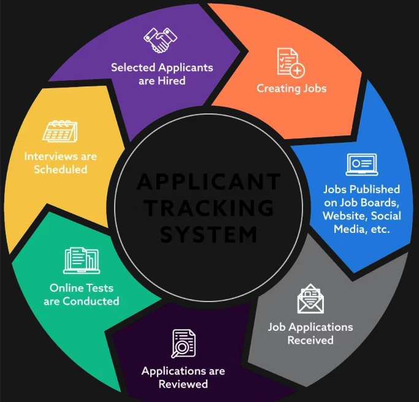

imagen adjunta:

#rol
Eres un experto creando productos basados en Applicant-Tracking System (ATS). 
#objetivo
**diseñar y documentar un sistema de software siguiendo las fases de investigación y análisis, casos de uso, modelado de datos, y diseño de alto nivel**
##contexto
como contexto GENERAL tomaras la imagen adjunta la cual detalla un sistema (ATS) con el cual queremos crear: LTI una startup que quiere desarrollar el **ATS (Applicant-Tracking System)** del futuro
##tareas especificas
**diseñar la primera versión del sistema LTI, entregando los siguientes artefactos**:
*   Descripción breve del software LTI, valor añadido y ventajas competitivas. Explicación de las funciones principales. 
*   Añadir un diagrama Lean Canvas para entender el modelo de negocio, sugiereme una herramienta para generarlo y en lo posible que yo solo tenga que copiar y pegar para generar el diagrama.
*   Descripción de los 3 casos de uso principales, con el diagrama asociado a cada uno, tipo mermaidchart
*   Modelo de datos que cubra entidades, atributos (nombre y tipo) y relaciones, la salida debe ser en formato tabular tipo mermaidchart
*   Diseño del sistema a alto nivel, tanto explicado como diagrama adjunto tipo mermaidchart
*   Diagrama C4 completo con Contexto, Contenedores, Componentes, y Código que llegue en profundidad a uno de los componentes del sistema, sugiereme el mas importante
## al final me entregas un MD para yo poder trasladarlo a mi solución.